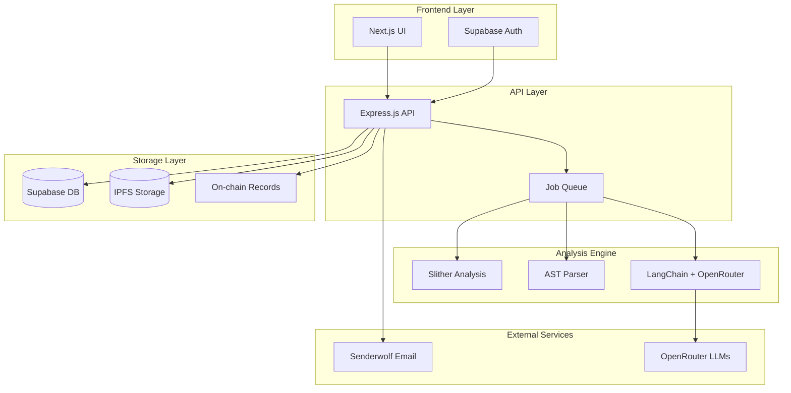

# Design Document

## Overview

Audit Wolf is architected as a modern, scalable web application that combines multiple analysis engines to provide comprehensive smart contract auditing. The system follows a microservices-inspired architecture with clear separation between the frontend presentation layer, backend API services, AI analysis pipeline, and data storage layers. The design prioritizes modularity, allowing for easy integration of new analysis tools and AI models while maintaining high performance and reliability.

## Architecture

### High-Level Architecture



### Technology Stack

- **Frontend**: Next.js 14 with App Router, TypeScript, Tailwind CSS, Shadcn UI
- **Backend**: Node.js with Express.js, TypeScript
- **AI Pipeline**: LangChain with OpenRouter integration
- **Database**: Supabase (PostgreSQL + Auth + Real-time)
- **Static Analysis**: Slither, Solidity AST parsing
- **Storage**: IPFS for decentralized report storage
- **Blockchain**: Ethereum/Polygon for audit record hashes
- **Email**: Senderwolf for report delivery
- **Queue**: Bull Queue with Redis for job processing

## Components and Interfaces

### Frontend Components

#### Core UI Components

- **ContractUploader**: Handles file uploads and code pasting with syntax highlighting
- **AuditDashboard**: Displays audit history, status, and results
- **ReportViewer**: Renders audit reports with interactive vulnerability details
- **ProgressTracker**: Real-time audit progress updates via WebSocket
- **ThemeProvider**: Dark/light theme switching with system preference detection

#### Pages and Routing

- `/` - Landing page with contract upload interface
- `/dashboard` - User audit history and management
- `/audit/[id]` - Individual audit results and report viewing
- `/auth` - Authentication flows (login/register)
- `/settings` - User preferences and API key management

### Backend API Endpoints

#### Contract Management

```typescript
POST /api/contracts/upload
POST /api/contracts/paste
GET /api/contracts/:id
DELETE /api/contracts/:id
```

#### Audit Operations

```typescript
POST /api/audits/start
GET /api/audits/:id/status
GET /api/audits/:id/report
POST /api/audits/:id/regenerate
```

#### User Management

```typescript
GET / api / user / audits;
GET / api / user / profile;
PUT / api / user / settings;
```

### Analysis Pipeline

#### Static Analysis Service

```typescript
interface StaticAnalysisResult {
	slitherFindings: SlitherVulnerability[];
	astAnalysis: ASTNode[];
	gasAnalysis: GasOptimization[];
	complexity: ComplexityMetrics;
}

class SlitherAnalyzer {
	async analyze(contractCode: string): Promise<StaticAnalysisResult>;
	private parseSlitherOutput(output: string): SlitherVulnerability[];
	private extractGasOptimizations(ast: ASTNode[]): GasOptimization[];
}
```

#### AI Analysis Service

```typescript
interface AIAnalysisResult {
	vulnerabilities: AIVulnerability[];
	recommendations: SecurityRecommendation[];
	codeQuality: QualityMetrics;
	confidence: number;
}

class AIAnalyzer {
	private langchain: LangChain;
	private models: OpenRouterModel[];

	async analyzeContract(
		code: string,
		staticResults: StaticAnalysisResult
	): Promise<AIAnalysisResult>;
	private ensembleAnalysis(results: AIAnalysisResult[]): AIAnalysisResult;
	private validateFindings(findings: AIVulnerability[]): AIVulnerability[];
}
```

## Data Models

### Core Entities

#### User Model

```typescript
interface User {
	id: string;
	email: string;
	name: string;
	subscription_tier: "free" | "pro" | "enterprise";
	api_credits: number;
	created_at: Date;
	updated_at: Date;
}
```

#### Contract Model

```typescript
interface Contract {
	id: string;
	user_id: string;
	name: string;
	source_code: string;
	compiler_version: string;
	file_hash: string;
	created_at: Date;
}
```

#### Audit Model

```typescript
interface Audit {
	id: string;
	contract_id: string;
	user_id: string;
	status: "pending" | "analyzing" | "completed" | "failed";
	static_results: StaticAnalysisResult;
	ai_results: AIAnalysisResult;
	final_report: AuditReport;
	ipfs_hash?: string;
	blockchain_tx?: string;
	created_at: Date;
	completed_at?: Date;
}
```

#### Vulnerability Model

```typescript
interface Vulnerability {
	id: string;
	audit_id: string;
	type:
		| "reentrancy"
		| "overflow"
		| "access_control"
		| "gas_optimization"
		| "best_practice";
	severity: "critical" | "high" | "medium" | "low" | "informational";
	title: string;
	description: string;
	location: CodeLocation;
	recommendation: string;
	confidence: number;
	source: "static" | "ai" | "combined";
}
```

### Database Schema

```sql
-- Users table (managed by Supabase Auth)
CREATE TABLE users (
  id UUID PRIMARY KEY DEFAULT gen_random_uuid(),
  email TEXT UNIQUE NOT NULL,
  name TEXT,
  subscription_tier TEXT DEFAULT 'free',
  api_credits INTEGER DEFAULT 10,
  created_at TIMESTAMP DEFAULT NOW(),
  updated_at TIMESTAMP DEFAULT NOW()
);

-- Contracts table
CREATE TABLE contracts (
  id UUID PRIMARY KEY DEFAULT gen_random_uuid(),
  user_id UUID REFERENCES users(id) ON DELETE CASCADE,
  name TEXT NOT NULL,
  source_code TEXT NOT NULL,
  compiler_version TEXT,
  file_hash TEXT UNIQUE,
  created_at TIMESTAMP DEFAULT NOW()
);

-- Audits table
CREATE TABLE audits (
  id UUID PRIMARY KEY DEFAULT gen_random_uuid(),
  contract_id UUID REFERENCES contracts(id) ON DELETE CASCADE,
  user_id UUID REFERENCES users(id) ON DELETE CASCADE,
  status TEXT DEFAULT 'pending',
  static_results JSONB,
  ai_results JSONB,
  final_report JSONB,
  ipfs_hash TEXT,
  blockchain_tx TEXT,
  created_at TIMESTAMP DEFAULT NOW(),
  completed_at TIMESTAMP
);

-- Vulnerabilities table
CREATE TABLE vulnerabilities (
  id UUID PRIMARY KEY DEFAULT gen_random_uuid(),
  audit_id UUID REFERENCES audits(id) ON DELETE CASCADE,
  type TEXT NOT NULL,
  severity TEXT NOT NULL,
  title TEXT NOT NULL,
  description TEXT NOT NULL,
  location JSONB NOT NULL,
  recommendation TEXT NOT NULL,
  confidence DECIMAL(3,2),
  source TEXT NOT NULL,
  created_at TIMESTAMP DEFAULT NOW()
);
```

## Error Handling

### Error Categories and Responses

#### Client Errors (4xx)

- **400 Bad Request**: Invalid contract syntax, unsupported file format
- **401 Unauthorized**: Missing or invalid authentication
- **403 Forbidden**: Insufficient credits or subscription limits
- **404 Not Found**: Audit or contract not found
- **429 Too Many Requests**: Rate limiting exceeded

#### Server Errors (5xx)

- **500 Internal Server Error**: Unexpected analysis failures
- **502 Bad Gateway**: External service unavailability (OpenRouter, Slither)
- **503 Service Unavailable**: System overload or maintenance
- **504 Gateway Timeout**: Analysis timeout (>5 minutes)

### Error Handling Strategy

```typescript
class ErrorHandler {
	static handleAnalysisError(error: AnalysisError): AuditResponse {
		switch (error.type) {
			case "SLITHER_TIMEOUT":
				return this.retryWithFallback(error);
			case "AI_MODEL_UNAVAILABLE":
				return this.useAlternativeModel(error);
			case "SYNTAX_ERROR":
				return this.provideSyntaxGuidance(error);
			default:
				return this.logAndNotifyAdmin(error);
		}
	}

	private static async retryWithFallback(
		error: AnalysisError
	): Promise<AuditResponse> {
		// Implement exponential backoff retry logic
	}
}
```

### Graceful Degradation

- If Slither fails, continue with AI-only analysis
- If primary AI model is unavailable, use backup models
- If IPFS is down, store reports in database only
- If blockchain is congested, queue transactions for later

## Testing Strategy

### Unit Testing

- **Frontend**: Jest + React Testing Library for component testing
- **Backend**: Jest + Supertest for API endpoint testing
- **Analysis**: Mock Slither output and AI responses for deterministic testing

### Integration Testing

- **API Integration**: Test complete audit workflows end-to-end
- **Database Integration**: Test Supabase operations and data consistency
- **External Services**: Test OpenRouter, Senderwolf, and IPFS integrations

### Performance Testing

- **Load Testing**: Simulate concurrent audit processing
- **Stress Testing**: Test system limits and failure modes
- **Analysis Performance**: Benchmark Slither and AI analysis times

### Security Testing

- **Authentication**: Test Supabase Auth integration and JWT handling
- **Input Validation**: Test contract code sanitization and validation
- **Data Protection**: Verify encryption and secure data handling

### Test Data Management

```typescript
// Mock contract samples for testing
const TEST_CONTRACTS = {
	VULNERABLE_REENTRANCY: `
    contract VulnerableBank {
      mapping(address => uint) balances;
      function withdraw() public {
        msg.sender.call.value(balances[msg.sender])("");
        balances[msg.sender] = 0;
      }
    }
  `,
	GAS_INEFFICIENT: `
    contract GasWaster {
      uint[] public data;
      function inefficientLoop() public {
        for(uint i = 0; i < data.length; i++) {
          data[i] = i;
        }
      }
    }
  `,
};
```

### Continuous Integration

- **GitHub Actions**: Automated testing on pull requests
- **Quality Gates**: Code coverage >80%, no critical vulnerabilities
- **Deployment Pipeline**: Automated deployment to staging and production
- **Monitoring**: Real-time error tracking and performance monitoring
