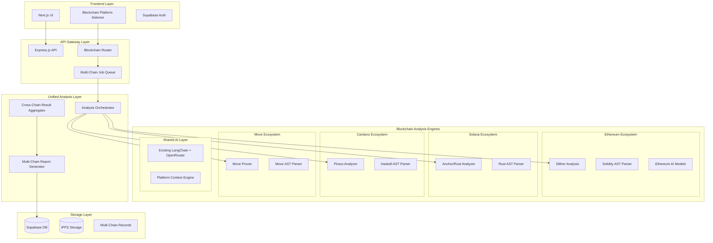

# Multi-Blockchain Support Design Document

## Overview

This design extends the existing Audit Wolf architecture to support smart contract analysis across multiple blockchain platforms while maintaining backward compatibility with the current Solidity-focused pipeline. The multi-blockchain support introduces a modular, plugin-based architecture that can accommodate different programming languages, static analysis tools, and blockchain-specific security patterns. The design emphasizes extensibility, allowing new blockchain platforms to be added without disrupting existing functionality.

## Architecture

### Extended High-Level Architecture



### Blockchain Platform Support Matrix

| Platform  | Language       | Static Analysis        | AI Models            | Status       |
| --------- | -------------- | ---------------------- | -------------------- | ------------ |
| Ethereum  | Solidity       | Slither, Mythril       | GPT-4, Claude        | ✅ Existing  |
| BSC       | Solidity       | Slither + BEP checks   | GPT-4, Claude        | 🔄 Extension |
| Polygon   | Solidity       | Slither + L2 checks    | GPT-4, Claude        | 🔄 Extension |
| Solana    | Rust/Anchor    | Clippy, Anchor lint    | Rust-specific models | 🆕 New       |
| Cardano   | Plutus/Haskell | Plutus static analysis | Haskell models       | 🆕 New       |
| Aptos/Sui | Move           | Move Prover            | Move-specific models | 🆕 New       |
| Cosmos    | CosmWasm/Rust  | CosmWasm lint          | Rust models          | 🆕 New       |

## Components and Interfaces

### Blockchain Abstraction Layer

#### Core Blockchain Interface

```typescript
interface BlockchainPlatform {
	id: string;
	name: string;
	supportedLanguages: string[];
	fileExtensions: string[];
	staticAnalyzers: StaticAnalyzer[];
	aiModels: AIModel[];
	validationRules: ValidationRule[];
}

interface StaticAnalyzer {
	name: string;
	command: string;
	outputParser: (output: string) => AnalysisResult;
	supportedLanguages: string[];
	installationCheck: () => Promise<boolean>;
}

interface AIModel {
	provider: string;
	modelId: string;
	specialization: string[];
	costPerToken: number;
	maxTokens: number;
}
```

#### Blockchain Registry

```typescript
class BlockchainRegistry {
	private platforms: Map<string, BlockchainPlatform> = new Map();

	registerPlatform(platform: BlockchainPlatform): void {
		this.platforms.set(platform.id, platform);
	}

	getPlatform(id: string): BlockchainPlatform | undefined {
		return this.platforms.get(id);
	}

	getSupportedPlatforms(): BlockchainPlatform[] {
		return Array.from(this.platforms.values());
	}

	detectPlatform(code: string, filename?: string): BlockchainPlatform[] {
		// Auto-detection logic based on syntax patterns and file extensions
	}
}
```

### Multi-Chain Analysis Orchestrator

```typescript
interface MultiChainAnalysisRequest {
	contracts: ContractInput[];
	platforms: string[];
	analysisOptions: AnalysisOptions;
	crossChainAnalysis: boolean;
}

interface ContractInput {
	code: string;
	filename: string;
	platform: string;
	dependencies?: ContractInput[];
}

class AnalysisOrchestrator {
	private registry: BlockchainRegistry;
	private analyzers: Map<string, BlockchainAnalyzer>;

	async analyzeMultiChain(
		request: MultiChainAnalysisRequest
	): Promise<MultiChainAnalysisResult> {
		const results: Map<string, AnalysisResult> = new Map();

		// Parallel analysis across platforms
		const analysisPromises = request.platforms.map(async (platformId) => {
			const platform = this.registry.getPlatform(platformId);
			const analyzer = this.analyzers.get(platformId);

			if (platform && analyzer) {
				const platformContracts = request.contracts.filter(
					(c) => c.platform === platformId
				);
				const result = await analyzer.analyze(platformContracts);
				results.set(platformId, result);
			}
		});

		await Promise.all(analysisPromises);

		// Cross-chain analysis if requested
		if (request.crossChainAnalysis) {
			const crossChainResult = await this.analyzeCrossChainInteractions(
				results
			);
			return this.aggregateResults(results, crossChainResult);
		}

		return this.aggregateResults(results);
	}

	private async analyzeCrossChainInteractions(
		results: Map<string, AnalysisResult>
	): Promise<CrossChainAnalysisResult> {
		// Analyze bridge contracts, message passing, and state consistency
	}
}
```

### Platform-Specific Analyzers

#### Solana Analyzer

```typescript
class SolanaAnalyzer implements BlockchainAnalyzer {
	async analyze(contracts: ContractInput[]): Promise<AnalysisResult> {
		const results: AnalysisResult = {
			staticAnalysis: await this.runRustAnalysis(contracts),
			aiAnalysis: await this.runSolanaAIAnalysis(contracts),
			platformSpecific: await this.runSolanaSpecificChecks(contracts),
		};

		return results;
	}

	private async runRustAnalysis(
		contracts: ContractInput[]
	): Promise<StaticAnalysisResult> {
		// Run Clippy, Anchor lint, and custom Solana security checks
		const clippyResults = await this.runClipper(contracts);
		const anchorResults = await this.runAnchorLint(contracts);
		const securityResults = await this.runSolanaSecurityChecks(contracts);

		return this.mergeStaticResults([
			clippyResults,
			anchorResults,
			securityResults,
		]);
	}

	private async runSolanaSpecificChecks(
		contracts: ContractInput[]
	): Promise<PlatformSpecificResult> {
		return {
			accountModelValidation: await this.validateAccountModel(contracts),
			pdaSecurityChecks: await this.checkPDAUsage(contracts),
			computeUnitOptimization: await this.analyzeComputeUnits(contracts),
			anchorFrameworkCompliance: await this.checkAnchorCompliance(contracts),
		};
	}
}
```

#### Cardano Analyzer

```typescript
class CardanoAnalyzer implements BlockchainAnalyzer {
	async analyze(contracts: ContractInput[]): Promise<AnalysisResult> {
		const results: AnalysisResult = {
			staticAnalysis: await this.runPlutusAnalysis(contracts),
			aiAnalysis: await this.runCardanoAIAnalysis(contracts),
			platformSpecific: await this.runCardanoSpecificChecks(contracts),
		};

		return results;
	}

	private async runPlutusAnalysis(
		contracts: ContractInput[]
	): Promise<StaticAnalysisResult> {
		// Run Plutus static analysis and Haskell type checking
		const plutusResults = await this.runPlutusStaticAnalysis(contracts);
		const haskellResults = await this.runHaskellLint(contracts);

		return this.mergeStaticResults([plutusResults, haskellResults]);
	}

	private async runCardanoSpecificChecks(
		contracts: ContractInput[]
	): Promise<PlatformSpecificResult> {
		return {
			utxoModelValidation: await this.validateUTXOHandling(contracts),
			datumValidation: await this.checkDatumUsage(contracts),
			scriptEfficiency: await this.analyzePlutusEfficiency(contracts),
			eUTXOCompliance: await this.checkEUTXOCompliance(contracts),
		};
	}
}
```

### Cross-Chain Analysis Engine

```typescript
interface CrossChainAnalysisResult {
	bridgeSecurityAssessment: BridgeSecurityResult;
	stateConsistencyAnalysis: StateConsistencyResult;
	interoperabilityRisks: InteroperabilityRisk[];
	crossChainRecommendations: CrossChainRecommendation[];
}

class CrossChainAnalyzer {
	async analyzeBridgeContracts(
		contracts: Map<string, ContractInput[]>
	): Promise<BridgeSecurityResult> {
		// Analyze cross-chain bridge implementations
		const lockingMechanisms = await this.analyzeLockingMechanisms(contracts);
		const messagePassing = await this.analyzeMessagePassing(contracts);
		const validatorSets = await this.analyzeValidatorSets(contracts);

		return {
			lockingMechanisms,
			messagePassing,
			validatorSets,
			overallSecurityScore: this.calculateBridgeSecurityScore([
				lockingMechanisms,
				messagePassing,
				validatorSets,
			]),
		};
	}

	async analyzeStateConsistency(
		results: Map<string, AnalysisResult>
	): Promise<StateConsistencyResult> {
		// Check for potential state inconsistencies across chains
		const stateVariables = this.extractStateVariables(results);
		const consistencyChecks = await this.performConsistencyChecks(
			stateVariables
		);

		return {
			potentialInconsistencies: consistencyChecks.filter((c) => c.risk > 0.5),
			recommendations:
				this.generateConsistencyRecommendations(consistencyChecks),
		};
	}
}
```

## Data Models

### Extended Database Schema

```sql
-- Blockchain platforms table
CREATE TABLE blockchain_platforms (
  id TEXT PRIMARY KEY,
  name TEXT NOT NULL,
  supported_languages TEXT[] NOT NULL,
  file_extensions TEXT[] NOT NULL,
  static_analyzers JSONB NOT NULL,
  ai_models JSONB NOT NULL,
  validation_rules JSONB NOT NULL,
  is_active BOOLEAN DEFAULT true,
  created_at TIMESTAMP DEFAULT NOW(),
  updated_at TIMESTAMP DEFAULT NOW()
);

-- Extended contracts table
ALTER TABLE contracts ADD COLUMN blockchain_platform TEXT REFERENCES blockchain_platforms(id);
ALTER TABLE contracts ADD COLUMN language TEXT NOT NULL DEFAULT 'solidity';
ALTER TABLE contracts ADD COLUMN dependencies JSONB;
ALTER TABLE contracts ADD COLUMN cross_chain_config JSONB;

-- Multi-chain audits table
CREATE TABLE multi_chain_audits (
  id UUID PRIMARY KEY DEFAULT gen_random_uuid(),
  user_id UUID REFERENCES users(id) ON DELETE CASCADE,
  audit_name TEXT NOT NULL,
  platforms TEXT[] NOT NULL,
  contracts JSONB NOT NULL,
  cross_chain_analysis BOOLEAN DEFAULT false,
  status TEXT DEFAULT 'pending',
  results JSONB,
  cross_chain_results JSONB,
  created_at TIMESTAMP DEFAULT NOW(),
  completed_at TIMESTAMP
);

-- Platform-specific vulnerabilities table
CREATE TABLE platform_vulnerabilities (
  id UUID PRIMARY KEY DEFAULT gen_random_uuid(),
  audit_id UUID REFERENCES audits(id) ON DELETE CASCADE,
  multi_chain_audit_id UUID REFERENCES multi_chain_audits(id) ON DELETE CASCADE,
  platform TEXT NOT NULL,
  vulnerability_type TEXT NOT NULL,
  severity TEXT NOT NULL,
  title TEXT NOT NULL,
  description TEXT NOT NULL,
  location JSONB NOT NULL,
  recommendation TEXT NOT NULL,
  platform_specific_data JSONB,
  confidence DECIMAL(3,2),
  source TEXT NOT NULL,
  created_at TIMESTAMP DEFAULT NOW()
);

-- Cross-chain analysis results table
CREATE TABLE cross_chain_analysis (
  id UUID PRIMARY KEY DEFAULT gen_random_uuid(),
  multi_chain_audit_id UUID REFERENCES multi_chain_audits(id) ON DELETE CASCADE,
  bridge_security_assessment JSONB,
  state_consistency_analysis JSONB,
  interoperability_risks JSONB,
  recommendations JSONB,
  created_at TIMESTAMP DEFAULT NOW()
);
```

### TypeScript Interfaces

```typescript
interface MultiChainContract {
	id: string;
	user_id: string;
	name: string;
	blockchain_platform: string;
	language: string;
	source_code: string;
	dependencies?: ContractDependency[];
	cross_chain_config?: CrossChainConfig;
	created_at: Date;
}

interface MultiChainAudit {
	id: string;
	user_id: string;
	audit_name: string;
	platforms: string[];
	contracts: MultiChainContract[];
	cross_chain_analysis: boolean;
	status: "pending" | "analyzing" | "completed" | "failed";
	results: Map<string, AnalysisResult>;
	cross_chain_results?: CrossChainAnalysisResult;
	created_at: Date;
	completed_at?: Date;
}

interface PlatformVulnerability extends Vulnerability {
	platform: string;
	platform_specific_data: Record<string, any>;
}
```

## Error Handling

### Platform-Specific Error Handling

```typescript
class MultiChainErrorHandler extends ErrorHandler {
	static handlePlatformError(error: PlatformAnalysisError): AuditResponse {
		switch (error.platform) {
			case "solana":
				return this.handleSolanaError(error);
			case "cardano":
				return this.handleCardanoError(error);
			case "ethereum":
				return this.handleEthereumError(error);
			default:
				return this.handleGenericPlatformError(error);
		}
	}

	private static handleSolanaError(error: SolanaAnalysisError): AuditResponse {
		if (error.type === "ANCHOR_BUILD_FAILED") {
			return {
				success: false,
				message:
					"Anchor build failed. Please check your Anchor.toml configuration.",
				suggestions: [
					"Verify Anchor version compatibility",
					"Check program dependencies",
					"Ensure proper account structure",
				],
			};
		}
		// Handle other Solana-specific errors
	}

	private static handleCardanoError(
		error: CardanoAnalysisError
	): AuditResponse {
		if (error.type === "PLUTUS_COMPILATION_FAILED") {
			return {
				success: false,
				message:
					"Plutus script compilation failed. Please check your Haskell syntax.",
				suggestions: [
					"Verify Plutus Core version",
					"Check type annotations",
					"Ensure proper UTXO handling",
				],
			};
		}
		// Handle other Cardano-specific errors
	}
}
```

### Graceful Degradation Strategy

- If a platform-specific analyzer fails, continue with available analyzers
- If cross-chain analysis fails, provide individual platform results
- If AI models for a specific platform are unavailable, use generic models with platform context
- If static analysis tools are missing, provide AI-only analysis with warnings

## Testing Strategy

### Multi-Platform Testing

```typescript
describe("Multi-Chain Analysis", () => {
	describe("Solana Analysis", () => {
		it("should analyze Anchor programs correctly", async () => {
			const solanaContract = TEST_CONTRACTS.SOLANA.ANCHOR_PROGRAM;
			const result = await solanaAnalyzer.analyze([solanaContract]);

			expect(result.platformSpecific.anchorFrameworkCompliance).toBeDefined();
			expect(result.platformSpecific.pdaSecurityChecks).toBeDefined();
		});

		it("should detect Solana-specific vulnerabilities", async () => {
			const vulnerableContract = TEST_CONTRACTS.SOLANA.VULNERABLE_PDA;
			const result = await solanaAnalyzer.analyze([vulnerableContract]);

			expect(result.vulnerabilities).toContainEqual(
				expect.objectContaining({
					type: "insecure_pda_derivation",
					severity: "high",
				})
			);
		});
	});

	describe("Cross-Chain Analysis", () => {
		it("should identify bridge security issues", async () => {
			const bridgeContracts = {
				ethereum: [TEST_CONTRACTS.ETHEREUM.BRIDGE_CONTRACT],
				solana: [TEST_CONTRACTS.SOLANA.BRIDGE_PROGRAM],
			};

			const result = await crossChainAnalyzer.analyzeBridgeContracts(
				bridgeContracts
			);

			expect(result.bridgeSecurityAssessment).toBeDefined();
			expect(result.overallSecurityScore).toBeGreaterThan(0);
		});
	});
});
```

### Test Contract Samples

```typescript
const TEST_CONTRACTS = {
	SOLANA: {
		ANCHOR_PROGRAM: `
      use anchor_lang::prelude::*;
      
      #[program]
      pub mod vulnerable_program {
          use super::*;
          
          pub fn initialize(ctx: Context<Initialize>) -> Result<()> {
              // Missing access control
              let account = &mut ctx.accounts.data_account;
              account.authority = ctx.accounts.user.key();
              Ok(())
          }
      }
    `,
		VULNERABLE_PDA: `
      // Insecure PDA derivation
      let (pda, _bump) = Pubkey::find_program_address(
          &[user.key().as_ref()], // Predictable seed
          program_id
      );
    `,
	},
	CARDANO: {
		PLUTUS_VALIDATOR: `
      {-# LANGUAGE DataKinds #-}
      {-# LANGUAGE TemplateHaskell #-}
      
      module VulnerableValidator where
      
      import Plutus.V2.Ledger.Api
      
      -- Vulnerable validator with missing checks
      validator :: BuiltinData -> BuiltinData -> BuiltinData -> ()
      validator _ _ _ = () -- Always validates
    `,
	},
};
```

## Performance Considerations

### Parallel Processing

- Analyze different blockchain platforms concurrently
- Use separate worker queues for each platform
- Implement platform-specific timeout configurations
- Cache analysis results for identical contracts

### Resource Management

```typescript
class ResourceManager {
	private platformLimits: Map<string, PlatformLimits> = new Map();

	async allocateResources(
		platform: string,
		analysisType: string
	): Promise<ResourceAllocation> {
		const limits = this.platformLimits.get(platform);

		if (!limits || this.isResourceAvailable(limits, analysisType)) {
			return this.reserveResources(platform, analysisType);
		}

		// Queue the analysis if resources are not available
		return this.queueAnalysis(platform, analysisType);
	}

	private isResourceAvailable(
		limits: PlatformLimits,
		analysisType: string
	): boolean {
		// Check CPU, memory, and concurrent analysis limits
	}
}
```

### Scalability Architecture

- Horizontal scaling of platform-specific analyzers
- Load balancing across analysis workers
- Caching of static analysis tool outputs
- Efficient database indexing for multi-platform queries

This design provides a robust, extensible foundation for supporting multiple blockchain platforms while maintaining the quality and reliability of the existing Solidity analysis pipeline.
