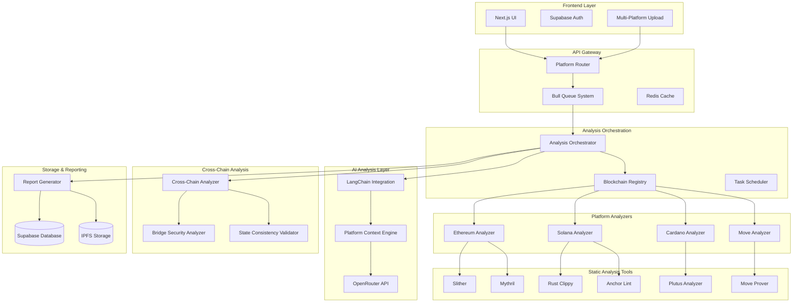

# Multi-Blockchain Architecture Overview

This document provides a comprehensive overview of Audit Wolf's multi-blockchain architecture, designed to support smart contract analysis across different blockchain platforms while maintaining extensibility and performance.

## System Architecture

### High-Level Architecture Diagram



## Core Components

### 1. Blockchain Registry System

The registry system manages supported blockchain platforms and their configurations:

```typescript
interface BlockchainPlatform {
	id: string;
	name: string;
	supportedLanguages: string[];
	fileExtensions: string[];
	staticAnalyzers: StaticAnalyzer[];
	aiModels: AIModel[];
	validationRules: ValidationRule[];
	networkConfigs: NetworkConfig[];
}

class BlockchainRegistry {
	private platforms: Map<string, BlockchainPlatform> = new Map();
	private analyzers: Map<string, BlockchainAnalyzer> = new Map();

	registerPlatform(platform: BlockchainPlatform): void {
		this.platforms.set(platform.id, platform);
		this.initializeAnalyzer(platform);
	}

	private initializeAnalyzer(platform: BlockchainPlatform): void {
		const analyzer = this.createAnalyzer(platform);
		this.analyzers.set(platform.id, analyzer);
	}

	getPlatform(id: string): BlockchainPlatform | undefined {
		return this.platforms.get(id);
	}

	getAnalyzer(platformId: string): BlockchainAnalyzer | undefined {
		return this.analyzers.get(platformId);
	}

	detectPlatform(code: string, filename?: string): BlockchainPlatform[] {
		const detectedPlatforms: BlockchainPlatform[] = [];

		for (const platform of this.platforms.values()) {
			if (this.matchesPlatform(code, filename, platform)) {
				detectedPlatforms.push(platform);
			}
		}

		return detectedPlatforms;
	}
}
```

### 2. Analysis Orchestrator

The orchestrator coordinates analysis across multiple platforms:

```typescript
interface MultiChainAnalysisRequest {
  contracts: ContractInput[];
  platforms: string[];
  analysisOptions: AnalysisOptions;
  crossChainAnalysis: boolean;
  userId: string;
  auditId: string;
}

class AnalysisOrchestrator {
  constructor(
    private registry: BlockchainRegistry,
    private queue: Queue,
    private contextEngine: PlatformContextEngine,
    private crossChainAnalyzer: CrossChainAnalyzer
  ) {}

  async analyzeMultiChain(
    request: MultiChainAnalysisRequest
  ): Promise<MultiChainAnalysisResult> {
    // Validate request
    this.validateRequest(request);

    // Group contracts by platform
    const contractsByPlatform = this.groupContractsByPlatform(request.contracts);

    // Create analysis jobs
    const analysisJobs = await this.createAnalysisJobs(
      contractsByPlatform,
      request
    );

    // Execute parallel analysis
    const platformResults = await this.executeParallelAnalysis(analysisJobs);

    // Perform cross-chain analysis if requested
    let crossChainResult: CrossChainAnalysisResult | undefined;
    if (request.crossChainAnalysis) {
      crossChainResult = await this.crossChainAnalyzer.analyze(
        platformResults,
        request
      );
    }

    // Aggregate and return results
    return this.aggregateResults(platformResults, crossChainResult);
  }

  private async executeParallelAnalysis(
    jobs: AnalysisJob[]
  ): Promise<Map<string, AnalysisResult>> {
    const results = new Map<string, AnalysisResult>();

    // Execute jobs in parallel with concurrency control
    const concurrency = this.calculateOptimalConcurrency(jobs);
    const chunks = this.chunkArray(jobs, concurrency);

    for (const chunk of chunks) {

```
